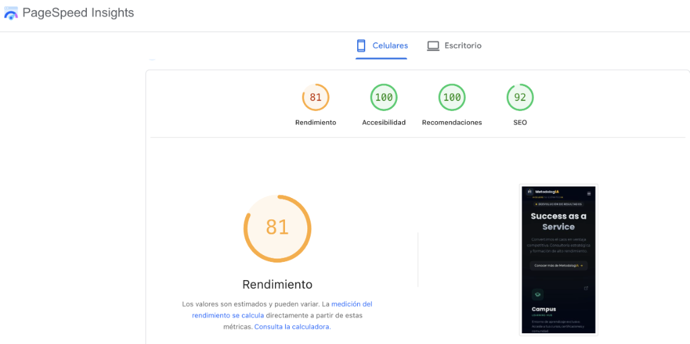
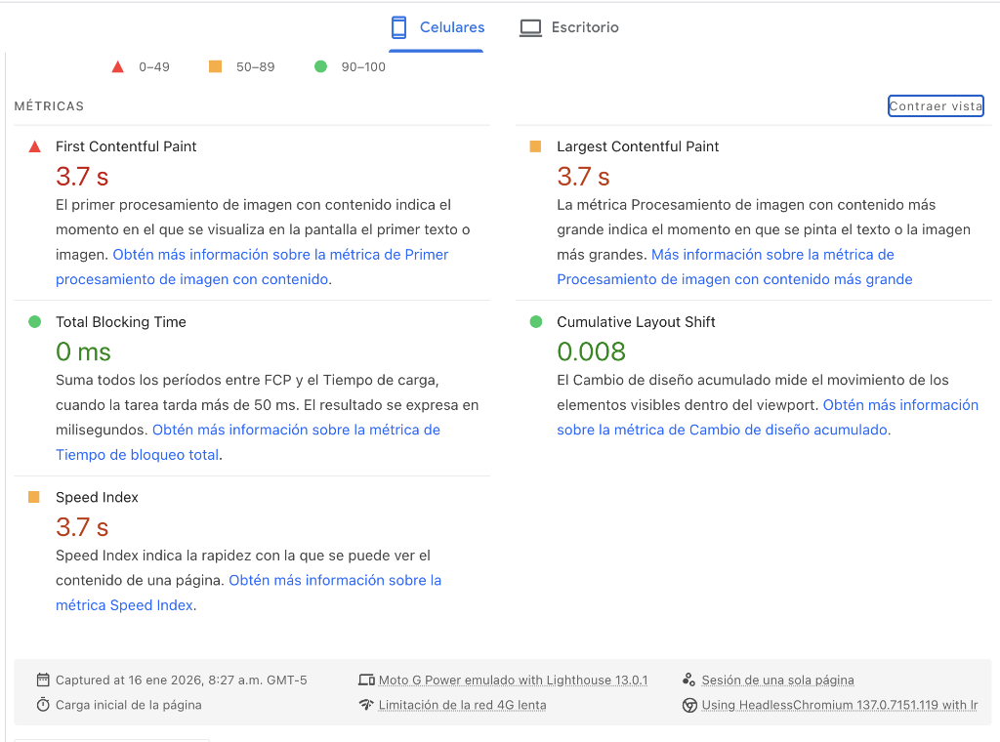
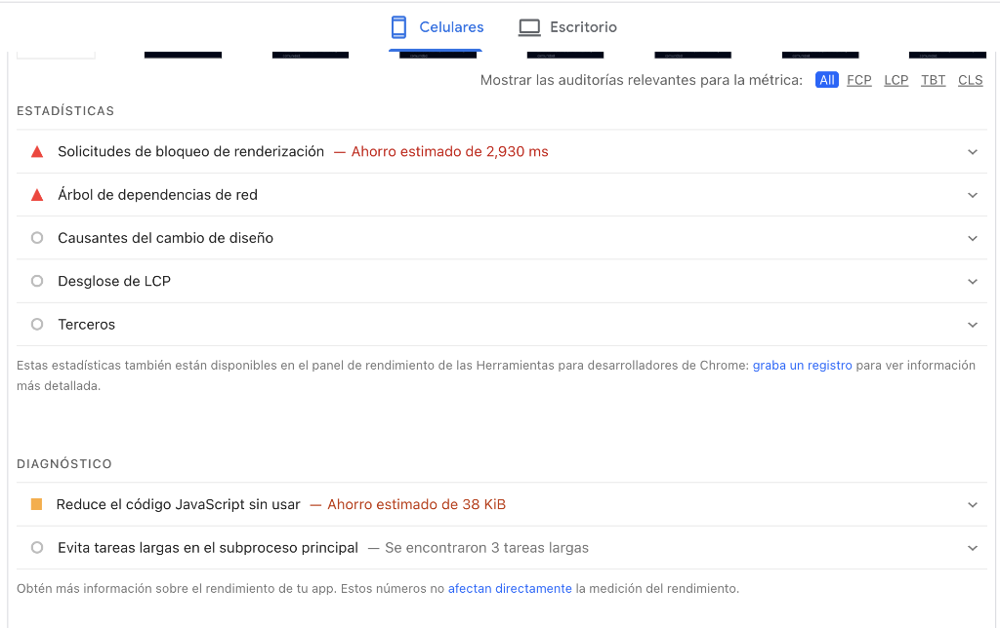
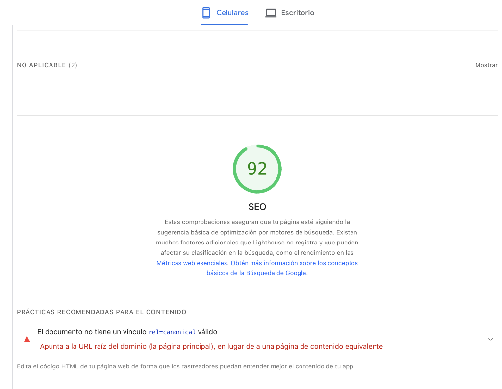

# 🔍 Diagnóstico Completo: index.html (Home/Gateway)

> **Fecha de Auditoría:** 16 de enero de 2026, 8:27 a.m. GMT-5  
> **URL:** https://metodologia.info/  
> **Versión del Sitio:** Gateway 3.0.0  
> **Herramienta:** Google PageSpeed Insights (Lighthouse 13.0.1)

---

## 📊 Resumen Ejecutivo

### Puntuación General (Mobile)

| Métrica | Puntuación | Estado |
|---------|------------|--------|
| **Rendimiento** | 81 | 🟠 Necesita Mejora |
| **Accesibilidad** | 100 | 🟢 Excelente |
| **Recomendaciones** | 100 | 🟢 Excelente |
| **SEO** | 92 | 🟢 Bueno |

> [!IMPORTANT]
> El sitio tiene **excelente accesibilidad y buenas prácticas**. El área de enfoque prioritario es el **rendimiento móvil**, específicamente los tiempos de carga inicial (FCP/LCP).

---

## 🎯 Core Web Vitals (Mobile)

### Métricas de Carga

| Métrica | Valor | Umbral Bueno | Umbral Pobre | Estado |
|---------|-------|--------------|--------------|--------|
| **First Contentful Paint (FCP)** | 3.7s | < 1.8s | > 3.0s | 🔴 Pobre |
| **Largest Contentful Paint (LCP)** | 3.7s | < 2.5s | > 4.0s | 🟠 Necesita Mejora |
| **Speed Index** | 3.7s | < 3.4s | > 5.8s | 🟠 Necesita Mejora |

### Métricas de Interactividad y Estabilidad

| Métrica | Valor | Umbral Bueno | Estado |
|---------|-------|--------------|--------|
| **Total Blocking Time (TBT)** | 0 ms | < 200ms | 🟢 Excelente |
| **Cumulative Layout Shift (CLS)** | 0.008 | < 0.1 | 🟢 Excelente |

---

## 🚨 Problemas Críticos Identificados

### 1. Solicitudes de Bloqueo de Renderización
**Impacto:** 🔴 Alto (ahorro estimado: **2,930 ms**)

Los recursos que bloquean el renderizado son la causa principal del pobre FCP/LCP:

| Recurso | Tipo | Línea en Código | Problema |
|---------|------|-----------------|----------|
| `https://cdn.tailwindcss.com` | JavaScript | L89 | Tailwind CDN compila estilos en el navegador |
| `https://fonts.googleapis.com/css2...` | CSS | L86 | 18 variantes de peso, sin preload |
| `https://unpkg.com/lucide@latest` | JavaScript | L91 | Librería completa, sin defer |

> [!CAUTION]
> **Tailwind CDN está diseñado para desarrollo, NO para producción.** Compila todos los estilos en runtime, añadiendo ~2-3 segundos de bloqueo.

---

### 2. JavaScript sin Usar
**Impacto:** 🟠 Medio (ahorro estimado: **38 KiB**)

- **Tailwind CSS CDN:** Incluye todas las utilidades (~300KB) cuando solo se usan ~50 clases
- **Lucide Icons:** Carga toda la librería cuando solo se usan ~15 iconos

---

### 3. Tareas Largas en el Subproceso Principal
**Impacto:** 🟠 Medio (3 tareas detectadas)

Aunque TBT es 0ms (excelente), hay 3 tareas que podrían optimizarse:
1. Compilación de Tailwind config (L94-L122)
2. Parsing de Google Fonts CSS
3. Inicialización de Lucide (`lucide.createIcons()`)

---

### 4. SEO: Advertencia de Canonical
**Impacto:** 🟡 Bajo

PageSpeed reporta advertencia de canonical, pero es un **falso positivo**:
```html
<link rel="canonical" href="https://metodologia.info/">
```
Para la home page, este canonical ES correcto.

---

## ✅ Puntos Fuertes del Sitio

| Área | Estado | Detalles |
|------|--------|----------|
| **Accesibilidad** | 🟢 100 | Excelente uso de `aria-label`, contraste WCAG, landmarks semánticos |
| **Buenas Prácticas** | 🟢 100 | HTTPS, sin JS vulnerable, headers correctos |
| **Estructura HTML** | 🟢 Óptima | 2 schemas JSON-LD (Organization, WebSite) bien implementados |
| **Open Graph** | 🟢 Completo | Todos los meta tags para redes sociales |
| **Mobile-Friendly** | 🟢 Sí | Viewport correcto, diseño 100% responsive |
| **Preconnects** | 🟢 Parcial | 3 de 4 necesarios implementados |
| **Tema Dinámico** | 🟢 Sí | theme-color con media queries |

---

## 📸 Capturas de Evidencia

Las capturas se encuentran en `capturas/`:

````carousel

<!-- slide -->

<!-- slide -->

<!-- slide -->

````

---

## 📊 Datos Técnicos de la Sesión

| Campo | Valor |
|-------|-------|
| Tipo de prueba | Carga inicial de la página |
| Sesión | Una sola página |
| Dispositivo emulado | Moto G Power |
| Limitación de red | 4G lenta |
| Motor de renderizado | HeadlessChromium 137.0.7151.119 |
| Versión Lighthouse | 13.0.1 |

---

## 🔗 Documentos Relacionados

- [ANALISIS_CODIGO.md](ANALISIS_CODIGO.md) - Análisis línea por línea del código fuente
- [../PLAN_INTEGRAL.md](../PLAN_INTEGRAL.md) - Plan de mejora integral del sitio
